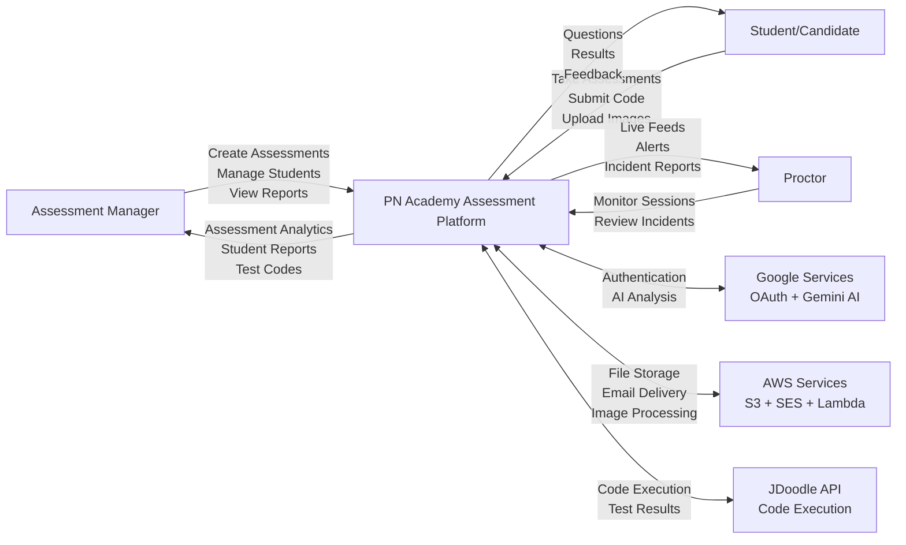

# PN Academy Assessment Platform - Updated System Design Documentation

## Table of Contents
1. [Entity Relationship (ER) Diagram](#1-entity-relationship-er-diagram)
2. [High Level Design (HLD)](#2-high-level-design-hld)
3. [Data Flow Diagram (DFD)](#3-data-flow-diagram-dfd)
4. [System Design Architecture](#4-system-design-architecture)
5. [Use Case Diagram](#5-use-case-diagram)

---

## 1. Entity Relationship (ER) Diagram

### Core Entities and Relationships (Updated with Latest Migrations)

```mermaid
erDiagram
    %% User Management
    User {
        int id PK
        string email UK
        string role
        datetime created_at
        datetime updated_at
        string phone_number
        string first_name
        string last_name
    }
    
    EmailWhitelist {
        int id PK
        string email UK
        string role
    }
    
    Role {
        string id PK
        string name UK
        json permissions
    }
    
    %% Assessment Structure
    Assessment {
        int id PK
        string title
        text description
        string assessment_type
        int created_by FK
        datetime created_at
        datetime updated_at
        boolean is_active
        boolean is_published
        int total_marks
        int passing_marks
        int total_sets
        int duration
        boolean is_proctored
        datetime start_time
        datetime end_time
        boolean is_electron_only
        int ai_generated_questions
        json attachments
        string universal_code
    }  
  
    Section {
        int id PK
        int assessment_id FK
        string name
        text description
        int num_of_questions
        int total_marks
        int negative_mark_per_question
        int duration
        int section_order
    }
    
    Question {
        int id PK
        int section_id FK
        text question_text
        string question_type
        json options
        json correct_answer
        text description
        json constraints
        text expected_output
        json test_cases
        int set_number
        int marks
        int negative_marks
        int question_order
        int time_limit
    }
    
    %% Student Management (Updated)
    Student {
        int id PK
        int csv_upload_id FK
        string email UK
        string full_name
        datetime created_at
        datetime updated_at
    }
    
    CSVUpload {
        int id PK
        int uploaded_by FK
        datetime uploaded_at
        string file_name
        int total_records
        int processed_records
        string status
        json errors
    }
    
    TestCode {
        int id PK
        string code UK
        int student_id FK
        int assessment_id FK
        datetime created_at
        boolean is_used
        boolean is_active
        datetime used_at
    }   
 
    %% Assessment Execution (Updated with Student Support)
    AssessmentAssignment {
        string id PK
        int assessment_id FK
        int candidate_id FK
        int assigned_by FK
        datetime assigned_at
        string status
        string unique_test_url
        boolean email_sent
        boolean is_marked_for_assignment
    }
    
    Report {
        string id PK
        string assignment_id FK
        int candidate_id FK
        int student_id FK
        int assessment_id FK
        datetime started_at
        datetime ended_at
        datetime submitted_at
        string status
        float total_marks
        float obtained_marks
        float percentage
        float percentile
        int position
        int window_switch_count
        boolean is_kicked_out
        text kicked_out_reason
        boolean is_cheating
        text cheating_reason
        int proctor_id FK
        int set_number
    }
    
    SectionReport {
        string id PK
        string report_id FK
        int section_id FK
        datetime started_at
        datetime ended_at
        float obtained_marks
        int total_questions
        int attempted_questions
        int correct_answers
        int wrong_answers
    }
    
    QuestionAttempt {
        string id PK
        string report_id FK
        int question_id FK
        datetime started_at
        datetime ended_at
        json selected_answer
        boolean is_correct
        float marks_obtained
        int time_taken
        boolean is_attempted
    }    
 
   %% Proctoring System
    ProctoringSession {
        string id PK
        string report_id FK
        int proctor_id FK
        datetime started_at
        datetime ended_at
        string status
        json recordings
        json incidents
        text notes
    }
    
    ProctoringSnapshot {
        string id PK
        string session_id FK
        string report_id FK
        int question_id FK
        datetime timestamp
        string image_url
        boolean suspicious_activity
        string activity_type
    }
    
    %% File Management
    AssessmentFile {
        int id PK
        int assessment_id FK
        string filename
        string s3_key
        string s3_url
        int file_size
        string upload_status
        string presigned_url
        datetime presigned_url_expires
        datetime created_at
        datetime updated_at
    }
    
    %% Notifications
    Notification {
        string id PK
        int user_id FK
        string type
        string title
        text message
        boolean is_read
        datetime created_at
        string related_entity_id
        string related_entity_type
    }    

    %% Relationships (Updated)
    User ||--o{ Assessment : creates
    User ||--o{ CSVUpload : uploads
    User ||--o{ AssessmentAssignment : assigns
    User ||--o{ AssessmentAssignment : assigned_to
    User ||--o{ Report : takes_as_candidate
    User ||--o{ ProctoringSession : proctors
    User ||--o{ Notification : receives
    
    Assessment ||--o{ Section : contains
    Assessment ||--o{ TestCode : has
    Assessment ||--o{ AssessmentAssignment : assigned
    Assessment ||--o{ Report : generates
    Assessment ||--o{ AssessmentFile : has_files
    
    Section ||--o{ Question : contains
    Section ||--o{ SectionReport : generates
    
    Question ||--o{ QuestionAttempt : attempted
    Question ||--o{ ProctoringSnapshot : monitored
    
    Student ||--o{ TestCode : has
    Student ||--o{ Report : takes_as_student
    CSVUpload ||--o{ Student : contains
    
    TestCode }o--|| Student : belongs_to
    TestCode }o--|| Assessment : for
    
    AssessmentAssignment ||--o{ Report : generates
    
    Report ||--o{ SectionReport : contains
    Report ||--o{ QuestionAttempt : contains
    Report ||--o{ ProctoringSession : monitored
    
    ProctoringSession ||--o{ ProctoringSnapshot : captures
```



### Key Changes in Latest Migration (0003_add_student_to_report.py):

1. **Report Model Updates**:
   - Added `student` field as nullable ForeignKey to Student model
   - Made `assignment` field nullable (was required before)
   - Made `candidate` field nullable (was required before)
   - Updated `question_type` choices in Question model

2. **Dual User Support**:
   - Reports can now be linked to either `User` (candidates) or `Student` entities
   - Supports both registered users and CSV-uploaded students
   - Flexible reporting system for different user types
---


## 2. High Level Design (HLD)

### Updated System Architecture Overview

```mermaid
graph TB
    %% Client Layer
    subgraph "Client Layer"
        WEB[Web Frontend<br/>React/Angular<br/>Assessment Managers]
        MOBILE[Mobile App<br/>React Native/Flutter<br/>Students]
        ELECTRON[Electron App<br/>Proctored Assessments<br/>Secure Environment]
    end
    
    %% Load Balancer & API Gateway
    LB[Load Balancer<br/>Nginx/AWS ALB]
    
    subgraph "API Layer"
        GATEWAY[Django REST Framework<br/>API Gateway<br/>Port: 8000]
        AUTH[JWT Authentication<br/>+ Google OAuth]
        MIDDLEWARE[Middleware Stack<br/>CORS, Rate Limiting, Logging]
    end
    
    %% Core Application Services
    subgraph "Core Services"
        USER_SVC[User Management<br/>Authentication & Roles]
        ASSESSMENT_SVC[Assessment Service<br/>CRUD & Publishing]
        STUDENT_SVC[Student Management<br/>CSV Processing & Test Codes]
        EXECUTION_SVC[Assessment Execution<br/>Question Delivery & Scoring]
        REPORT_SVC[Reporting Service<br/>Performance Analytics]
    end
    
    %% Specialized Services
    subgraph "Specialized Services"
        PROCTORING_SVC[Proctoring Service<br/>Real-time Monitoring]
        FILE_SVC[File Management<br/>S3 Integration & Presigned URLs]
        EMAIL_SVC[Email Service<br/>Bulk Notifications via SES]
        CODE_SVC[Code Execution<br/>JDoodle API Integration]
        AI_SVC[AI Analysis<br/>Gemini Integration]
    end
    
    %% External Services
    subgraph "External APIs"
        GEMINI[Google Gemini AI<br/>Educational Analysis]
        GOOGLE_OAUTH[Google OAuth 2.0<br/>Authentication]
        JDOODLE[JDoodle API<br/>Code Execution]
        AWS_S3[AWS S3<br/>File Storage]
        AWS_SES[AWS SES<br/>Email Delivery]
        AWS_LAMBDA[AWS Lambda<br/>Image Processing]
    end
    
    %% Data Layer
    subgraph "Data Layer"
        PRIMARY_DB[(PostgreSQL/SQLite<br/>Primary Database)]
        CACHE_DB[(Redis<br/>Session & Cache)]
        FILE_STORAGE[(AWS S3<br/>Files & Images)]
    end    
 
   %% Connections
    WEB --> LB
    MOBILE --> LB
    ELECTRON --> LB
    
    LB --> GATEWAY
    GATEWAY --> AUTH
    GATEWAY --> MIDDLEWARE
    
    MIDDLEWARE --> USER_SVC
    MIDDLEWARE --> ASSESSMENT_SVC
    MIDDLEWARE --> STUDENT_SVC
    MIDDLEWARE --> EXECUTION_SVC
    MIDDLEWARE --> REPORT_SVC
    MIDDLEWARE --> PROCTORING_SVC
    MIDDLEWARE --> FILE_SVC
    MIDDLEWARE --> EMAIL_SVC
    MIDDLEWARE --> CODE_SVC
    MIDDLEWARE --> AI_SVC
    
    AUTH --> GOOGLE_OAUTH
    AI_SVC --> GEMINI
    CODE_SVC --> JDOODLE
    EMAIL_SVC --> AWS_SES
    FILE_SVC --> AWS_S3
    PROCTORING_SVC --> AWS_LAMBDA
    
    USER_SVC --> PRIMARY_DB
    ASSESSMENT_SVC --> PRIMARY_DB
    STUDENT_SVC --> PRIMARY_DB
    EXECUTION_SVC --> PRIMARY_DB
    REPORT_SVC --> PRIMARY_DB
    PROCTORING_SVC --> PRIMARY_DB
    
    GATEWAY --> CACHE_DB
    EXECUTION_SVC --> CACHE_DB
    
    FILE_SVC --> FILE_STORAGE
    PROCTORING_SVC --> FILE_STORAGE
```



### Technology Stack (Based on Codebase Analysis)

#### Backend Framework
- **Django 5.1.5**: Web framework (from `admin.py`, `models.py`)
- **Django REST Framework**: API development (from `views.py`, `serializers.py`)
- **Python 3.10+**: Programming language

#### Database & Storage
- **PostgreSQL**: Production database (from `.env`)
- **SQLite**: Development database (from `settings.py`)
- **AWS S3**: File storage (from `utils.py`, `AssessmentS3Handler`)

#### Authentication & Security
- **JWT**: Token-based authentication (from `utils.py`, `generate_jwt_tokens`)
- **Google OAuth 2.0**: Third-party authentication (from `views.py`, `auth_receiver`)
- **Role-based Access**: Admin, Assessment Manager, Proctor roles (from `models.py`)

#### External Integrations
- **Google Gemini AI**: Educational analysis (from `views.py`, `GenerateStudentReportView`)
- **JDoodle API**: Code execution (from `views.py`, `RunCodeView`)
- **AWS SES**: Email delivery (from `views.py`, `SendBulkEmailView`)
- **AWS Lambda**: Image processing (from `views.py`, `call_lambda_function`)---

## 
3. Data Flow Diagram (DFD)

### Level 0 - Context Diagram



### Level 1 - System Processes

```mermaid
graph TB
    %% External Entities
    ADMIN[Assessment Manager]
    STUDENT[Student/Candidate]
    PROCTOR[Proctor]
    
    %% Main Processes (Based on views.py analysis)
    P1[1.0<br/>User Authentication<br/>& Authorization]
    P2[2.0<br/>Assessment<br/>Management]
    P3[3.0<br/>Student<br/>Management]
    P4[4.0<br/>Assessment<br/>Execution]
    P5[5.0<br/>Code Execution<br/>& Evaluation]
    P6[6.0<br/>Proctoring<br/>System]
    P7[7.0<br/>Report Generation<br/>& Analytics]
    P8[8.0<br/>File Management<br/>& Storage]
    P9[9.0<br/>Communication<br/>& Notifications]
    
    %% Data Stores (Based on models.py)
    D1[(D1: Users & Roles)]
    D2[(D2: Assessments & Questions)]
    D3[(D3: Students & Test Codes)]
    D4[(D4: Reports & Attempts)]
    D5[(D5: Files & Attachments)]
    D6[(D6: Proctoring Data)]
    D7[(D7: Notifications)]    

    %% External Systems
    GOOGLE[Google Services]
    AWS[AWS Services]
    JDOODLE[JDoodle API]
    
    %% Data Flows - Authentication (SignupView, LoginView, ResetPasswordView)
    ADMIN -->|Login Credentials| P1
    STUDENT -->|Login/OAuth| P1
    P1 -->|JWT Tokens| ADMIN
    P1 -->|JWT Tokens| STUDENT
    P1 <-->|User Data| D1
    P1 <-->|OAuth Verification| GOOGLE
    
    %% Data Flows - Assessment Management (AssessmentViewSet)
    ADMIN -->|Assessment Data<br/>Sections & Questions| P2
    P2 -->|Assessment Details<br/>Statistics| ADMIN
    P2 <-->|Assessment Info| D2
    P2 <-->|File References| D5
    
    %% Data Flows - Student Management (StudentCSVUploadView, TestCode generation)
    ADMIN -->|CSV Files<br/>Assignment Requests| P3
    P3 -->|Student Lists<br/>Test Codes| ADMIN
    P3 <-->|Student Data| D3
    P3 <-->|Assessment Links| D2
    
    %% Data Flows - Assessment Execution (Based on Report model updates)
    STUDENT -->|Test Code<br/>Answers<br/>Code Submissions| P4
    P4 -->|Questions<br/>Results<br/>Feedback| STUDENT
    P4 <-->|Assessment Data| D2
    P4 <-->|Student/Candidate Data| D3
    P4 <-->|Attempt Records| D4
    P4 -->|Code for Execution| P5
    
    %% Data Flows - Code Execution (RunCodeView, SubmitCodeView)
    P5 <-->|Code & Results| JDOODLE
    P5 -->|Execution Results| P4
    
    %% Data Flows - Proctoring (upload_student_image, ProctoringSession)
    STUDENT -->|Images<br/>Screen Data| P6
    PROCTOR -->|Monitoring Commands| P6
    P6 -->|Alerts<br/>Incidents| PROCTOR
    P6 <-->|Session Data| D6
    P6 <-->|Images| AWS
    P6 <-->|Report Links| D4
    
    %% Data Flows - Reporting (GenerateStudentReportView with Gemini AI)
    P7 <-->|Performance Data| D4
    P7 <-->|AI Analysis| GOOGLE
    ADMIN -->|Report Requests| P7
    P7 -->|Analytics<br/>AI Insights| ADMIN
    STUDENT -->|Report Requests| P7
    P7 -->|Personal Reports| STUDENT
    
    %% Data Flows - File Management (GeneratePresignedURLView, S3Handler)
    ADMIN -->|File Uploads| P8
    P8 -->|Presigned URLs| ADMIN
    P8 <-->|File Metadata| D5
    P8 <-->|File Storage| AWS
    
    %% Data Flows - Communication (SendBulkEmailView)
    P9 -->|Emails<br/>Notifications| STUDENT
    P9 <-->|Email Service| AWS
    P9 <-->|Notification Data| D7
    ADMIN -->|Email Requests| P9
```#
## Level 2 - Assessment Execution Process (Detailed)

```mermaid
graph TB
    %% External Entity
    STUDENT[Student/Candidate]
    
    %% Sub-processes (Based on actual view implementations)
    P41[4.1<br/>Validate Test Code<br/>GetAssessmentTestCodesView]
    P42[4.2<br/>Load Assessment<br/>AssessmentViewSet.retrieve]
    P43[4.3<br/>Present Questions<br/>Question Delivery]
    P44[4.4<br/>Capture Responses<br/>QuestionAttempt Creation]
    P45[4.5<br/>Execute Code<br/>RunCodeView/SubmitCodeView]
    P46[4.6<br/>Calculate Scores<br/>Auto-grading Logic]
    P47[4.7<br/>Generate Report<br/>GenerateStudentReportView]
    
    %% Data Stores
    D2[(D2: Assessments)]
    D3[(D3: Students & TestCodes)]
    D4[(D4: Reports & Attempts)]
    JDOODLE[JDoodle API]
    
    %% Process Flow
    STUDENT -->|Test Code| P41
    P41 <-->|Code Validation| D3
    P41 -->|Valid Access| P42
    
    P42 <-->|Assessment Structure| D2
    P42 -->|Questions & Sections| P43
    
    P43 -->|Question Display| STUDENT
    STUDENT -->|Answers & Code| P44
    
    P44 -->|Code Submissions| P45
    P45 <-->|Execution Request| JDOODLE
    P45 -->|Execution Results| P44
    
    P44 -->|Response Data| P46
    P46 <-->|Scoring Rules| D2
    P46 -->|Calculated Scores| P47
    
    P47 <-->|Report Storage| D4
    P47 -->|Final Results| STUDENT
```

---

## 4. System Design Architecture

### Microservices Architecture (Based on Django Apps Structure)

```mermaid
graph TB
    %% API Gateway Layer
    subgraph "API Gateway Layer"
        GATEWAY[Django REST Framework<br/>urls.py routing<br/>Port: 8000]
        AUTH_MW[JWT Authentication<br/>JWTAuthentication class]
        PERM_MW[Permission Middleware<br/>IsAuthenticated, IsAdminUser]
        CORS_MW[CORS Middleware<br/>corsheaders]
    end    
 
   %% Core Service Layer (Based on ViewSets and APIViews)
    subgraph "Core Services"
        USER_SVC[User Service<br/>SignupView, LoginView<br/>UserViewSet, ResetPasswordView]
        ASSESSMENT_SVC[Assessment Service<br/>AssessmentViewSet<br/>AssessmentView, SampleJSON]
        STUDENT_SVC[Student Service<br/>StudentViewSet, StudentCSVUploadView<br/>AssignAssessmentToCSVView]
        EXECUTION_SVC[Execution Service<br/>Test Taking & Scoring<br/>Report Generation]
    end
    
    %% Specialized Services
    subgraph "Specialized Services"
        PROCTORING_SVC[Proctoring Service<br/>upload_student_image<br/>ProctoringSession Management]
        REPORT_SVC[Report Service<br/>GenerateStudentReportView<br/>AI-Powered Analytics]
        FILE_SVC[File Service<br/>GeneratePresignedURLView<br/>CheckFileStatusView, S3Handler]
        EMAIL_SVC[Email Service<br/>SendBulkEmailView<br/>SES Integration]
        CODE_SVC[Code Execution Service<br/>RunCodeView, SubmitCodeView<br/>JDoodle Integration]
    end
    
    %% Data Access Layer (Based on models.py)
    subgraph "Data Models"
        USER_MODELS[User Models<br/>User, EmailWhitelist, Role]
        ASSESSMENT_MODELS[Assessment Models<br/>Assessment, Section, Question]
        STUDENT_MODELS[Student Models<br/>Student, CSVUpload, TestCode]
        REPORT_MODELS[Report Models<br/>Report, SectionReport<br/>QuestionAttempt]
        PROCTORING_MODELS[Proctoring Models<br/>ProctoringSession<br/>ProctoringSnapshot]
        FILE_MODELS[File Models<br/>AssessmentFile]
        NOTIFICATION_MODELS[Notification Models<br/>Notification]
    end
    
    %% External Services (Based on integrations in views.py)
    subgraph "External Integrations"
        GEMINI_API[Google Gemini AI<br/>Educational Analysis<br/>_generate_ai_tips method]
        GOOGLE_OAUTH[Google OAuth 2.0<br/>auth_receiver function]
        JDOODLE_API[JDoodle API<br/>Code Execution Platform]
        AWS_S3[AWS S3<br/>AssessmentS3Handler]
        AWS_SES[AWS SES<br/>django-ses backend]
        AWS_LAMBDA[AWS Lambda<br/>call_lambda_function]
    end
    
    %% Database Layer
    subgraph "Database Layer"
        PRIMARY_DB[(PostgreSQL/SQLite<br/>Primary Database<br/>dj-database-url config)]
        CACHE_DB[(Redis Cache<br/>Session Storage<br/>Performance Optimization)]
    end  
  
    %% Service Connections
    GATEWAY --> AUTH_MW
    AUTH_MW --> PERM_MW
    PERM_MW --> CORS_MW
    
    CORS_MW --> USER_SVC
    CORS_MW --> ASSESSMENT_SVC
    CORS_MW --> STUDENT_SVC
    CORS_MW --> EXECUTION_SVC
    CORS_MW --> PROCTORING_SVC
    CORS_MW --> REPORT_SVC
    CORS_MW --> FILE_SVC
    CORS_MW --> EMAIL_SVC
    CORS_MW --> CODE_SVC
    
    %% Data Model Connections
    USER_SVC --> USER_MODELS
    ASSESSMENT_SVC --> ASSESSMENT_MODELS
    STUDENT_SVC --> STUDENT_MODELS
    EXECUTION_SVC --> REPORT_MODELS
    PROCTORING_SVC --> PROCTORING_MODELS
    FILE_SVC --> FILE_MODELS
    EMAIL_SVC --> NOTIFICATION_MODELS
    
    %% External Service Connections
    USER_SVC --> GOOGLE_OAUTH
    REPORT_SVC --> GEMINI_API
    CODE_SVC --> JDOODLE_API
    FILE_SVC --> AWS_S3
    EMAIL_SVC --> AWS_SES
    PROCTORING_SVC --> AWS_LAMBDA
    
    %% Database Connections
    USER_MODELS --> PRIMARY_DB
    ASSESSMENT_MODELS --> PRIMARY_DB
    STUDENT_MODELS --> PRIMARY_DB
    REPORT_MODELS --> PRIMARY_DB
    PROCTORING_MODELS --> PRIMARY_DB
    FILE_MODELS --> PRIMARY_DB
    NOTIFICATION_MODELS --> PRIMARY_DB
    
    USER_SVC --> CACHE_DB
    EXECUTION_SVC --> CACHE_DB
```



### Key Architectural Patterns (From Codebase Analysis)

#### 1. **Model-View-Serializer Pattern**
- **Models**: Database entities in `models.py` (User, Assessment, Student, etc.)
- **Views**: Business logic in `views.py` (ViewSets, APIViews)
- **Serializers**: Data validation and transformation in `serializers.py`

#### 2. **Authentication & Authorization**
- **JWT Authentication**: Custom `JWTAuthentication` class
- **Role-Based Access**: Admin, Assessment Manager, Proctor roles
- **Google OAuth Integration**: `auth_receiver` function

#### 3. **File Management Strategy**
- **AWS S3 Integration**: `AssessmentS3Handler` class
- **Presigned URLs**: Secure file upload/download
- **File Status Tracking**: `AssessmentFile` model

#### 4. **External API Integration**
- **Gemini AI**: Educational analysis and insights
- **JDoodle**: Code execution and testing
- **AWS Services**: S3, SES, Lambda integration---


## 5. Use Case Diagram

### Primary Actors and Use Cases (Based on Actual Implementation)

```mermaid
graph LR
    %% Actors (Based on role choices in models.py)
    ADMIN[Assessment Manager]
    STUDENT[Student/Candidate]
    PROCTOR[Proctor]
    SYSTEM[System]
    
    %% Authentication Use Cases (From views.py)
    subgraph "Authentication & User Management"
        UC1[Register Account - SignupView]
        UC2[Login with Email - LoginView]
        UC3[Login with Google OAuth - auth_receiver]
        UC4[Reset Password - ResetPasswordView]
        UC5[Manage User Roles - UserViewSet]
    end
    
    %% Assessment Management (From AssessmentViewSet)
    subgraph "Assessment Management"
        UC6[Create Assessment - AssessmentViewSet.create]
        UC7[Edit Assessment - AssessmentViewSet.update]
        UC8[Publish Assessment - publish action]
        UC9[Duplicate Assessment - duplicate action]
        UC10[Delete Assessment - AssessmentViewSet.destroy]
        UC11[View Statistics - statistics action]
        UC12[Manage Attachments - AssessmentFile]
    end
    
    %% Student Management (From Student-related views)
    subgraph "Student Management"
        UC13[Upload Student CSV - StudentCSVUploadView]
        UC14[Generate Test Codes - AssignAssessmentToCSVView]
        UC15[Assign Assessments - AssignAssessmentToCSVView]
        UC16[Send Bulk Emails - SendBulkEmailView]
        UC17[View Student Lists - StudentViewSet]
        UC18[Manage CSV Uploads - CSVUploadViewSet]
    end
    
    %% Assessment Taking (From execution-related views)
    subgraph "Assessment Execution"
        UC19[Enter Test Code - GetAssessmentTestCodesView]
        UC20[Take Assessment - Assessment Execution Flow]
        UC21[Submit Answers - QuestionAttempt Creation]
        UC22[Execute Code - RunCodeView]
        UC23[Submit Code Solution - SubmitCodeView]
        UC24[View Results - Report Generation]
    end
    
    %% Proctoring (From proctoring views)
    subgraph "Proctoring System"
        UC25[Monitor Live Session - ProctoringSession]
        UC26[Upload Student Images - upload_student_image]
        UC27[Review Incidents - ProctoringSnapshot]
        UC28[Flag Suspicious Activity - Proctoring Analysis]
        UC29[Generate Proctoring Report - Session Reports]
    end   
 
    %% Reporting & Analytics (From GenerateStudentReportView)
    subgraph "Reporting & Analytics"
        UC30[Generate Student Reports - GenerateStudentReportView]
        UC31[AI-Powered Analysis - Gemini Integration]
        UC32[Performance Analytics - Report Analysis]
        UC33[Export Reports - Report Data Export]
        UC34[View Assessment Analytics - Assessment Statistics]
    end
    
    %% File Management (From file-related views)
    subgraph "File Management"
        UC35[Upload Files - GeneratePresignedURLView]
        UC36[Check File Status - CheckFileStatusView]
        UC37[List Assessment Files - ListAssessmentFilesView]
        UC38[Manage S3 Storage - AssessmentS3Handler]
    end
    
    %% System Processes (Automated)
    subgraph "Automated Processes"
        UC39[Auto-Grade Assessments - Scoring Logic]
        UC40[Generate AI Insights - Gemini Analysis]
        UC41[Send Notifications - Email System]
        UC42[Process Images - Lambda Functions]
        UC43[Backup Data - System Maintenance]
        UC44[Code Execution - JDoodle Integration]
    end
    
    %% Actor-Use Case Relationships (Assessment Manager)
    ADMIN --> UC1
    ADMIN --> UC2
    ADMIN --> UC3
    ADMIN --> UC4
    ADMIN --> UC5
    ADMIN --> UC6
    ADMIN --> UC7
    ADMIN --> UC8
    ADMIN --> UC9
    ADMIN --> UC10
    ADMIN --> UC11
    ADMIN --> UC12
    ADMIN --> UC13
    ADMIN --> UC14
    ADMIN --> UC15
    ADMIN --> UC16
    ADMIN --> UC17
    ADMIN --> UC18
    ADMIN --> UC30
    ADMIN --> UC32
    ADMIN --> UC33
    ADMIN --> UC34
    ADMIN --> UC35
    ADMIN --> UC36
    ADMIN --> UC37
    
    %% Actor-Use Case Relationships (Student/Candidate)
    STUDENT --> UC2
    STUDENT --> UC3
    STUDENT --> UC19
    STUDENT --> UC20
    STUDENT --> UC21
    STUDENT --> UC22
    STUDENT --> UC23
    STUDENT --> UC24
    STUDENT --> UC26
    
    %% Actor-Use Case Relationships (Proctor)
    PROCTOR --> UC2
    PROCTOR --> UC3
    PROCTOR --> UC25
    PROCTOR --> UC27
    PROCTOR --> UC28
    PROCTOR --> UC29
    
    %% Actor-Use Case Relationships (System)
    SYSTEM --> UC39
    SYSTEM --> UC40
    SYSTEM --> UC41
    SYSTEM --> UC42
    SYSTEM --> UC43
    SYSTEM --> UC44  
  
    %% Include Relationships (Based on implementation dependencies)
    UC20 -.->|includes| UC19
    UC21 -.->|includes| UC20
    UC24 -.->|includes| UC21
    UC23 -.->|includes| UC22
    UC15 -.->|includes| UC14
    UC16 -.->|includes| UC17
    UC8 -.->|includes| UC6
    UC31 -.->|includes| UC30
    UC44 -.->|includes| UC22
    
    %% Extend Relationships (Based on optional features)
    UC28 -.->|extends| UC25
    UC31 -.->|extends| UC30
    UC42 -.->|extends| UC26
    UC40 -.->|extends| UC39
```



### Detailed Use Case Descriptions (Based on Actual Code)

#### UC6: Create Assessment (AssessmentViewSet.create)
- **Actor**: Assessment Manager
- **Implementation**: `AssessmentViewSet.create` method in `views.py`
- **Serializer**: `AssessmentSerializer` in `serializers.py`
- **Models**: `Assessment`, `Section`, `Question` in `models.py`
- **Flow**:
  1. User provides assessment data via API
  2. `AssessmentSerializer` validates input structure
  3. Creates `Assessment`, `Section`, and `Question` objects
  4. Calculates total marks and duration automatically
  5. Returns created assessment with ID

#### UC22: Execute Code (RunCodeView)
- **Actor**: Student/Candidate
- **Implementation**: `RunCodeView` class in `views.py`
- **Serializer**: `RunCodeSerializer` in `serializers.py`
- **External API**: JDoodle API integration
- **Flow**:
  1. Student submits code with language and input
  2. `RunCodeSerializer` validates code and parameters
  3. System calls JDoodle API for execution
  4. Returns execution results (output, errors, execution time)

#### UC30: Generate Student Reports (GenerateStudentReportView)
- **Actor**: Assessment Manager/Student
- **Implementation**: `GenerateStudentReportView` class in `views.py`
- **AI Integration**: Google Gemini API via `_generate_ai_tips` method
- **Models**: `Report`, `QuestionAttempt`, `SectionReport`
- **Flow**:
  1. System collects performance data from attempts
  2. Calculates section-wise and overall statistics
  3. Calls Gemini AI for educational insights
  4. Generates comprehensive report with recommendations

#### UC13: Upload Student CSV (StudentCSVUploadView)
- **Actor**: Assessment Manager
- **Implementation**: `StudentCSVUploadView` class in `views.py`
- **Models**: `CSVUpload`, `Student`
- **Flow**:
  1. User uploads CSV file with student data
  2. System validates CSV format and columns
  3. Processes each row and creates `Student` objects
  4. Tracks upload status and errors in `CSVUpload` model

### Actor Permissions (Based on Role Choices)

#### Assessment Manager (`assessment_manager` role)
- Full CRUD operations on assessments
- Student management and CSV operations
- Report generation and analytics
- File management and system configuration

#### Student/Candidate
- Take assigned assessments via test codes
- Execute and submit code solutions
- View personal results and reports
- Upload images for proctoring

#### Proctor (`proctor` role)
- Monitor live assessment sessions
- Review proctoring incidents and snapshots
- Generate proctoring reports
- Flag suspicious activities

---

## Summary

This updated system design documentation reflects the actual implementation in the PN Academy codebase:

### Key Implementation Highlights

1. **Dual User Support**: Recent migration (0003) added Student support to Report model
2. **Comprehensive API Coverage**: 40+ endpoints covering all major functionality
3. **AI Integration**: Gemini AI for educational analysis and personalized feedback
4. **External Service Integration**: JDoodle for code execution, AWS for infrastructure
5. **Role-Based Security**: JWT authentication with granular permissions
6. **File Management**: S3 integration with presigned URLs for secure uploads
7. **Real-Time Proctoring**: Image capture and AWS Lambda processing
8. **Scalable Architecture**: Django REST Framework with modular service design

### Technology Stack Validation
- **Backend**: Django 5.1.5 + DRF (confirmed from imports)
- **Database**: PostgreSQL/SQLite with Django ORM (from settings)
- **Authentication**: JWT + Google OAuth (from auth implementation)
- **Storage**: AWS S3 (from S3Handler class)
- **AI**: Google Gemini (from report generation)
- **Code Execution**: JDoodle API (from RunCodeView)

This documentation serves as a comprehensive technical blueprint for understanding, maintaining, and scaling the PN Academy Assessment Platform.